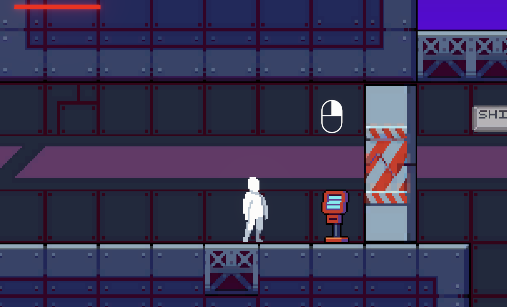
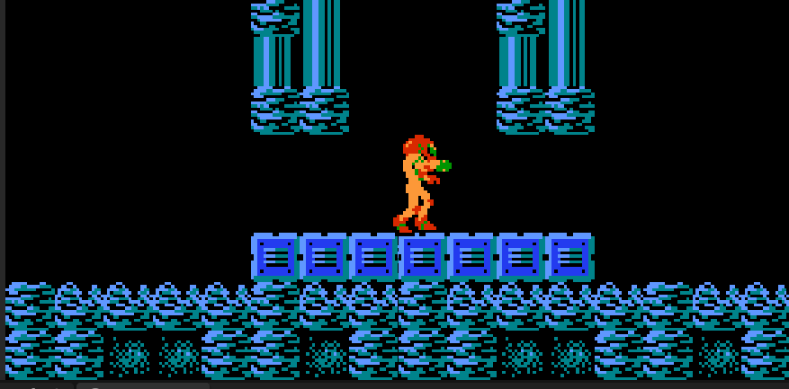
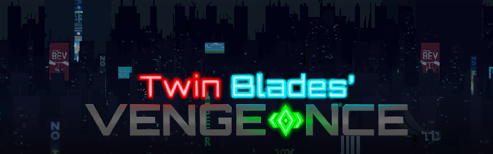
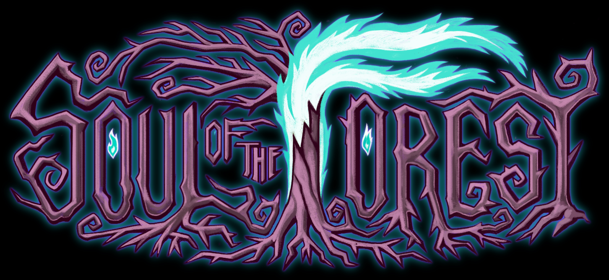
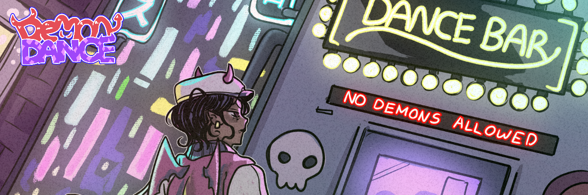
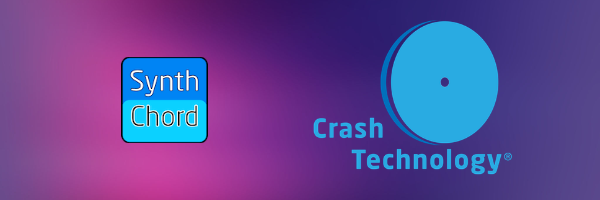

## Neon Hacker
Action adventure platforming game developed in Unity. I focused on creating a hacking mechanic in which players can hack access points to gain control of machines and objects in the game. 
- 
- Tags: Category 1
- Badges:
  - Game Dev [green]
- Buttons:
  - Link [https://zwagaroo.itch.io/neon-hacker-demo]

## Metroid NES Recreation
Recreation of Metroid NES. I focused on recreating the movement of metroid and the various enemies. This also includes a custom level which introduces a new Jetpack mechanic.
- 
- Tags: Category 1
- Badges:
  - Game Dev [green]
- Buttons:
  - Link [https://zwagaroo.itch.io/metroid-nes-recreation]

## Twin Blade's Vengence
2D Cyberpunk Fighting Game
- 
- Tags: Category 1
- Badges:
  - Game Dev [green]
- Buttons:
  - Link [https://wolverinesoft-studio.itch.io/twin-blades]

## Soul of the Forest
2D RPG
- 
- Tags: Category 1
- Badges:
  - Game Dev [green]
- Buttons:
  - Link [https://wolverinesoft-studio.itch.io/soul-of-the-forest]

## Demon Dance
Small fun game modeled off of FNF!
- 
- Tags: Category 3
- Badges:
  - Game Dev [green]
- Buttons:
  - Link [https://thevoices.itch.io/demon-dance]

## SynthChord
Software in Julia for transcribing and converting music using different harmonic templates for instruments 
- 
- Tags: Category 2
- Badges:
  - Software Engineering [orange]
- Buttons:
  - Link [https://github.com/zwagaroo/synthchord]

